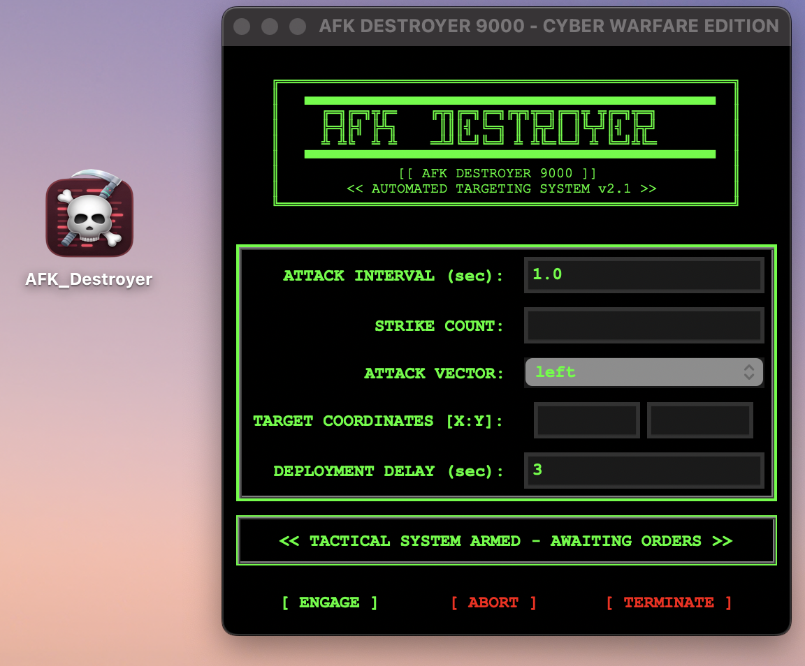

# 🎯 AFK DESTROYER 9000

> "When you need to click, but your fingers need a break... Deploy the cyber artillery."

[](https://opensource.org/licenses/MIT)
[](https://www.python.org/)

## 🚀 Overview

AFK Destroyer 9000 is a high-tech, military-grade automated clicking system designed for those moments when your fingers need a tactical retreat. With its matrix-inspired interface and cyber warfare aesthetics, it's not just an autoclicker - it's a clicking revolution!



## ⚡ Features

- 🎯 Precision targeting system with customizable coordinates
- ⏰ Tactical deployment delay for strategic timing
- 🔄 Continuous operation mode or specified strike count
- 🖱️ Multiple attack vectors (left, right, middle mouse buttons)
- 🎮 Real-time status updates with matrix-style display
- 🌟 Cyber warfare themed UI with blinking elements and ASCII art

## 📦 Installation

### Option 1: Run from Source

1. **Clone the Repository:**
   ```bash
   git clone https://github.com/Toonlaf/AFK_Destroyer_Autoclicker_9000.git
   cd AFK_Destroyer_Autoclicker_9000
   ```

2. **Install the Package:**
   ```bash
   pip install .
   ```

3. **Launch the Application:**
   ```bash
   python3 -m autoclicker
   ```

### Option 2: Build Standalone Executable

1. **Clone and Setup:**
   ```bash
   git clone https://github.com/Toonlaf/AFK_Destroyer_Autoclicker_9000.git
   cd AFK_Destroyer_Autoclicker_9000
   ```

2. **Install PyInstaller:**
   ```bash
   pip install pyinstaller
   ```

3. **Build the Executable:**
   ```bash
   pyinstaller --windowed --name "AFKDestroyer9000" --icon=applogo.png autoclicker/__main__.py
   ```

4. **Run the Application:**
   - The executable will be in the `dist/AFKDestroyer9000` folder
   - On macOS: Double click `dist/AFKDestroyer9000/AFKDestroyer9000`
   - On Windows: Double click `dist\AFKDestroyer9000\AFKDestroyer9000.exe`

### Option 3: Virtual Environment Installation

If you prefer using a virtual environment:

1. **Create and Activate Virtual Environment:**
   ```bash
   python3 -m venv venv
   source venv/bin/activate  # On macOS/Linux
   # or
   .\venv\Scripts\activate  # On Windows
   ```

2. **Install in the Virtual Environment:**
   ```bash
   pip install .
   ```

3. **Launch:**
   ```bash
   python3 -m autoclicker
   ```

To exit the virtual environment when done, type:
```bash
deactivate
```

## 💻 Usage

1. Set your **ATTACK INTERVAL** (delay between clicks)
2. Choose your **STRIKE COUNT** (leave empty for infinite)
3. Select your **ATTACK VECTOR** (mouse button)
4. Input **TARGET COORDINATES** (optional for fixed-position clicking)
5. Set **DEPLOYMENT DELAY** for countdown
6. Hit **[ ENGAGE ]** to commence the operation
7. Use **[ ABORT ]** for tactical retreat
8. **[ TERMINATE ]** for full system shutdown

## ⚠️ Disclaimer

With great power comes great responsibility. This tool was created for legitimate automation purposes eheh. Use it wisely and ethically!

## 🤝 Contributing

Want to join the cyber revolution?

1. 🔀 Fork the arsenal
2. 🛠️ Create your feature branch
3. 💻 Commit your changes
4. 🚀 Push to the branch
5. ⚔️ Open a Pull Request

## 📜 License

MIT License - Freedom to deploy as you see fit. Check the LICENSE file for intel.

## 🙏 Acknowledgments

- The Matrix for aesthetic inspiration
- BOREDOM for fueling development
- Python for making it possible
- You for being awesome enough to use this

---

<div align="center">
    <i>Remember: In cyberspace, every click counts! 🎯</i>
</div>
